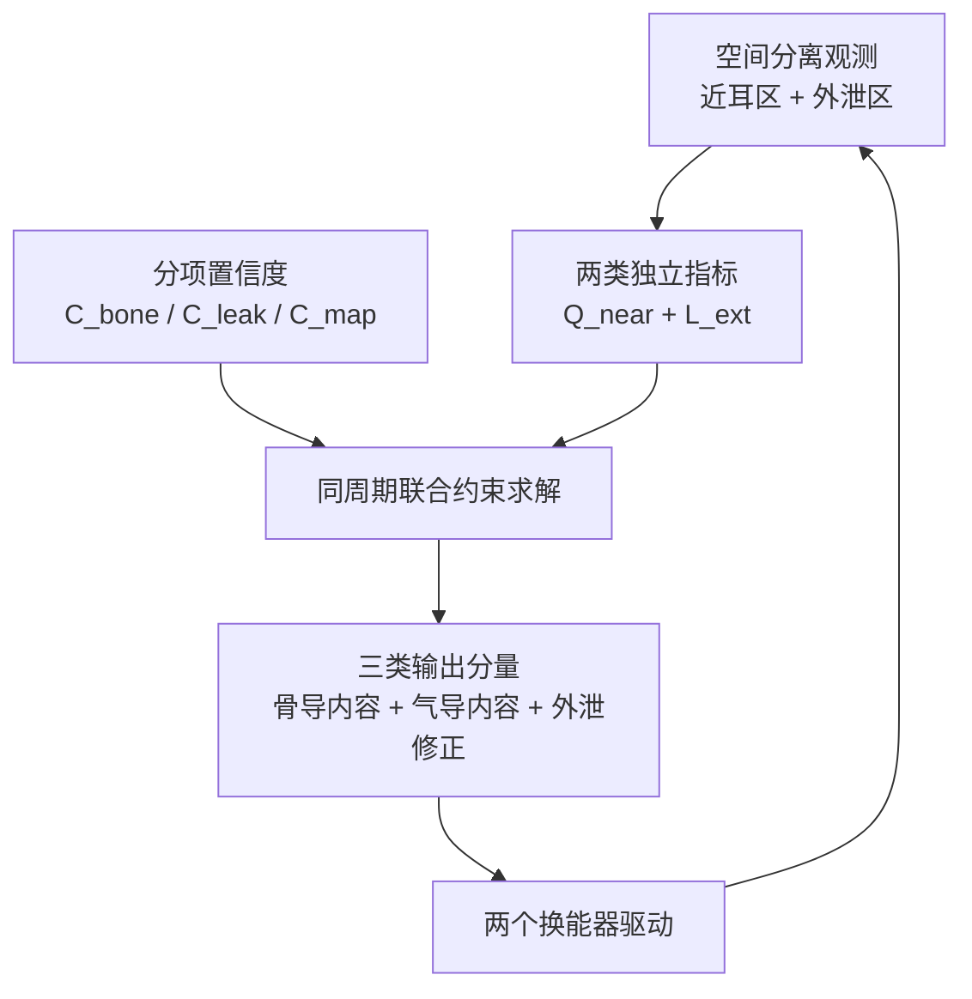
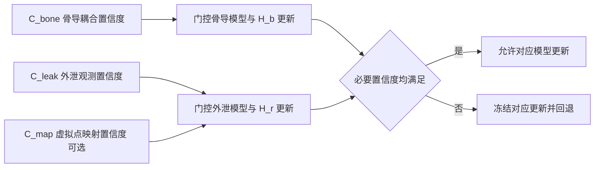
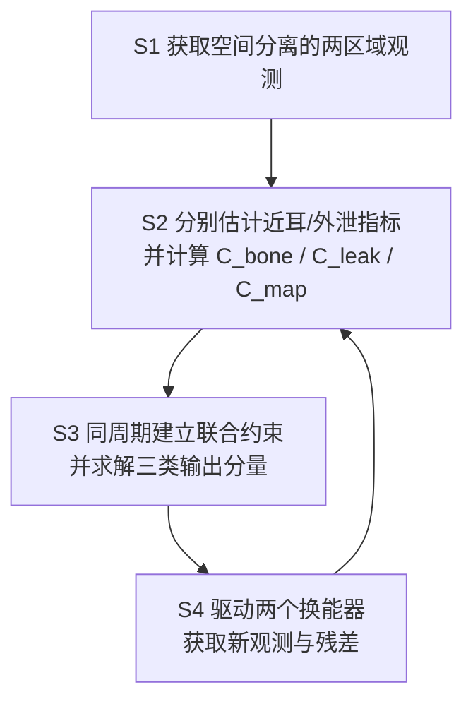
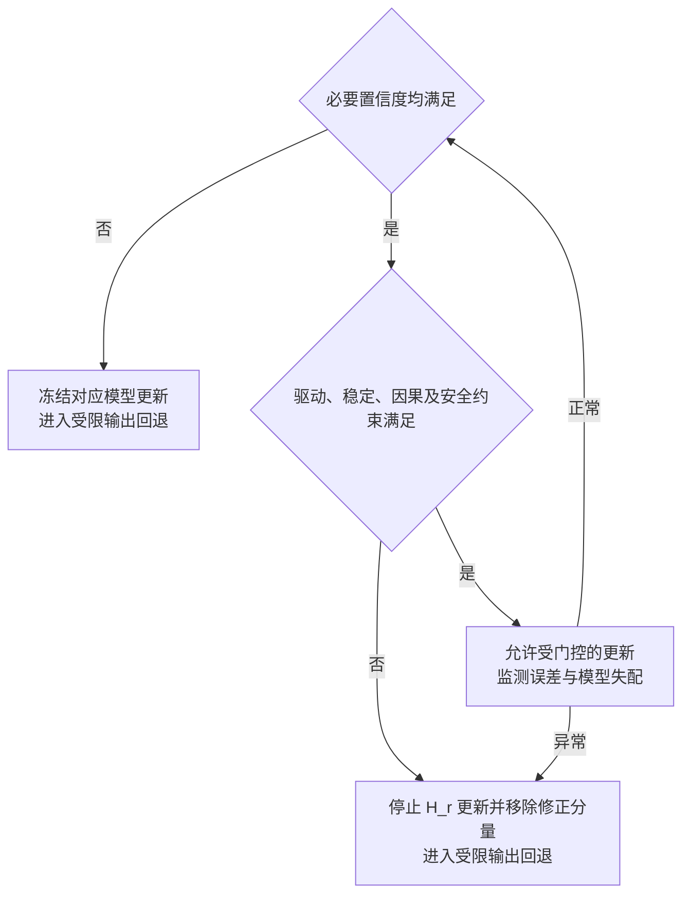

# 技术交底书

**案件名称**：一种基于双区域性能约束和分项模型置信度的骨导—气导协同控制方法、系统及 AI 眼镜

**技术联系人**：
- 姓名：待填写
- 电话：待填写
- 邮箱：待填写

**专利类型**：发明

---

## 注意事项

（1）交底书应使代理人能看懂，尤其是背景技术和详细技术方案，一定要写得全面、清楚、完整；

（2）技术的公开程度，应以本领域普通技术人员不需付出创造性劳动即可进行实施为准；

（3）在与代理人沟通时，对于代理人咨询的技术问题，应给予回答并按要求补充技术材料；

（4）本稿用于冻结候选技术方案。宽泛的“骨导换能器、气导换能器及麦克风反馈控制气导声抑制骨导空气辐射”组合不作为本案欲保护点；正式申请前，应结合样机数据和目标法域专利案卷进一步确定保护范围。

## 一、介绍相关技术背景，描述与本发明技术最相近的现有技术，并说明该现有技术存在的缺点

### 1.1 现有技术

检索说明：在国家知识产权局专利公布公告系统及 Google Patents 中，以“骨导气导”“智能眼镜漏音”“开放式音频反馈”“多麦外泄声场”“佩戴耦合校准”等为主要检索词，对骨导—气导联合播放、眼镜漏音控制、可穿戴设备校准和多麦空间观测相关公开文本进行检索，并对重点专利的公开文本和著录项进行复核。

#### 1.1.1 骨导与气导分频或联合播放

Nokia 的 US20130051585A1 公开由气导换能器接收第一频带、身体振动或骨导换能器接收第二频带，并可将该组合用于眼镜框。该方案表明，骨导与气导的静态分频、并行播放及换能器在眼镜上的组合已属于公开技术。其局限在于：方案重点在频带分配与联合播放，未建立针对佩戴者近耳区域和外部泄漏区域的双区域性能约束，也未处理佩戴耦合可信度不足时的闭环回退。

来源链接：<https://patents.google.com/patent/US20130051585A1/en>

#### 1.1.2 骨导空气辐射的反馈抵消

Amazon 的 US10699691B1 公开眼镜式框架、骨导扬声器、气导扬声器以及参考或误差麦克风，并根据噪声信号生成抵消音频，使气导输出与骨导产生的空气辐射形成破坏性干涉。其独立权利要求还覆盖较少麦克风限制的方法和双扬声器干涉结构。因此，宽泛的“骨导 + 气导 + 麦克风反馈 + 气导抵消骨导漏音”不作为本案区别点。该公开文本没有当然解决以下问题：如何分别估计近耳重放质量与多个外部空间位置的泄漏风险；如何在最低近耳质量、最大外泄、安全声剂量和稳定裕量等显式约束下联合分配内容分量；以及如何根据佩戴耦合和观测模型置信度执行门控与安全回退。

来源链接：<https://patents.google.com/patent/US10699691B1/en>

#### 1.1.3 双换能器校准与佩戴状态

Meta 的 US10658995B1 公开利用气导和骨导多频音、耳道声压、骨导电压等生成均衡滤波器，并可结合加速度计、麦克风或力传感器。该方案表明，双换能器的多频校准和传感器辅助校准已被公开。其局限在于：未必覆盖在正常播放内容满足持续激励条件时进行在线辨识、分别输出骨导耦合、外泄观测及可选空间映射置信度、依据对应置信度选择更新或冻结自适应系数并进入安全回退的完整控制链。

来源链接：<https://patents.google.com/patent/US10658995B1/en>

#### 1.1.4 环境噪声驱动的开放式眼镜音量控制

Bose 的 US20200143790A1 公开开放式可穿戴设备或音频眼镜检测环境噪声并自动调整输出，使输出与环境保持目标关系。该方案表明，仅按照“嘈杂环境增大输出、安静环境减小输出”进行模式或音量控制难以构成本案区别点。其局限在于：未将佩戴者近耳质量与外部泄漏分别建模为不同控制区域，也未将骨导内容、气导内容和外泄修正分量置于统一约束求解中。

来源链接：<https://patents.google.com/patent/US20200143790A1/en>

#### 1.1.5 相位、时延和泄漏路径自适应

CN119922457A 公开针对骨导与气导信号建立传递关系、估计相位或时延并优化补偿参数，公开内容还涉及个体曲线、场景识别和泄漏路径。该方案表明，相位同步、时延补偿、传递函数标定及自适应泄漏抑制不能单独作为本案核心。其局限在于：尚不能据此推导出本案的双区域指标、三类输出分量、显式性能约束、分项模型置信度和异常回退之间的组合关系。

来源链接：<http://epub.cnipa.gov.cn/patent/CN119922457A>

#### 1.1.6 多麦空间观测与开放式声学控制

Huawei 的 US20250039599A1 公开智能眼镜上的方向性麦克风阵列及镜框、鼻托或镜腿上的麦克风布置；WO2022226696A1 公开使用多麦估计空间噪声，并涉及骨导目标信息、气导降噪以及通道状态。上述技术表明，多麦阵列、方向估计和一般环境噪声控制已经存在。其局限在于：对于仅具有一个气导空气声辐射单元的设备，多麦主要增强观测与外泄场估计，并不能自动形成传统输出波束；同时，现有技术未当然给出以外部多个实际或虚拟监听点为对象、同时满足近耳质量与外部泄漏冲突约束的实现门槛和失配回退。

来源链接：<https://patents.google.com/patent/US20250039599A1/en>

来源链接：<https://patents.google.com/patent/WO2022226696A1/en>

#### 1.1.7 检索总结及本案本质区别

现有技术已经覆盖换能器并列、静态或动态分频、环境切换、骨导空气辐射的气导抵消、多麦阵列、相位时延校准和部分佩戴校准。因此，本案不以这些单一要素为核心。本案候选区别在于：建立佩戴者近耳区域和外部泄漏区域两类独立性能估计；生成骨导内容分量、气导内容分量和气导外泄修正分量；在显式近耳质量、外泄、安全、功耗和稳定约束下联合求解；根据骨导耦合、外泄观测及可选空间映射的分项置信度控制相应自适应更新，并在模型失配或反馈发散时执行可验证的安全回退。

### 1.2 现有技术存在的缺点

（1）现有方案多以单一环境音量、单一误差点或单一泄漏路径为控制对象，难以同时描述佩戴者听感与旁观者泄漏之间的冲突；

（2）现有骨导—气导联合方案通常采用固定分频、模式切换或单一抵消滤波，未必能在同一控制周期内联合满足近耳质量、外泄上限、声剂量、功耗和稳定性要求；

（3）骨导传递路径随刺激位置、界面机械阻抗、佩戴位移和个体差异变化，固定模型可能导致效果下降，甚至使外泄修正分量放大误差；

（4）多麦观测存在阵列失配、路径相干性不足、因果裕量不足和虚拟监听点偏差等问题，现有方案缺少将观测可信度直接用于闭环门控与回退的完整机制；

（5）在只有一个气导空气声辐射单元时，不能简单套用多空气声扬声器的输出波束形成逻辑，需建立适合跨介质双通道和单气导辐射源的控制模型。

## 二、针对上述缺点，说明本发明所要解决的技术问题

本发明拟解决以下技术问题：

（1）如何分别获得佩戴者近耳区域的重放质量或可懂度指标，以及眼镜外部一个或多个空间位置或方向的泄漏指标；

（2）如何根据骨导耦合状态和声学观测可信度，在近耳质量下限、外泄上限、安全声剂量、功耗和稳定裕量约束下，联合确定骨导内容、气导内容及气导外泄修正分量；

（3）如何在麦克风数量可扩展的条件下，利用双麦最小配置或多麦增强配置估计外泄声场，而不将多麦输入错误等同于输出波束形成；

（4）如何在佩戴变化、持续激励不足、观测失配或自适应发散时，冻结高风险更新并切换到低风险输出状态；

（5）如何把内容的隐私等级映射为可测量的外部声学阈值，并在分类失败或系统异常时采用更严格的本地缺省策略。

## 三、本发明技术方案的详细阐述

### 3.1 背景

本方案适用于具有一个骨导换能器和一个气导换能器的眼镜式可穿戴设备。麦克风数量不限定：双麦配置可作为最小实施例，多麦配置可作为外泄声场估计和参考通道选择的增强实施例。设备播放的内容可以是语音助手响应、通话、导航提示或媒体内容。

本方案采用双区域、多目标、分置信度门控的跨模态闭环。双区域是指佩戴者近耳区域和与近耳区域空间分离的眼镜外部泄漏区域；多目标是指近耳质量、外部泄漏、安全、功耗、舒适度和稳定性之间的联合约束；分置信度门控是指分别计算骨导耦合置信度 C_bone、外泄观测置信度 C_leak，以及多麦虚拟监听点实施例中的映射置信度 C_map，并由与被更新模型相对应的置信度控制更新或回退，避免一个高置信度掩盖另一个低置信度。

### 3.2 系统框图

分项置信度及门控关系如下：

### 3.3 模块功能说明

#### 3.3.1 环境参考观测模块

用于获得环境声级、频谱、语音活动、声源方向或空间统计量。双麦最小实施例中，可由外向麦克风承担该作用；多麦实施例中，可由阵列根据方向、相干性或因果裕量选择或加权参考通道。

#### 3.3.2 近耳质量观测模块

用于生成佩戴者侧重放质量的在线代理量。该模块可基于靠近耳侧的麦克风、已标定的传递模型、播放内容特征和环境噪声估计近耳信噪比、频带完整性或可懂度代理量。在线代理量用于控制，不等同于人体主观测试结果；人体可懂度需在验证阶段单独测量。

#### 3.3.3 外部泄漏观测模块

用于估计眼镜外部一个或多个位置、方向或距离的泄漏声指标。双麦最小实施例中，可使用一支近耳或外泄误差麦；多麦实施例中，可依据麦克风几何、传递矩阵、方向估计和空间协方差生成实际监听点或虚拟监听点。该模块只用于空间观测和控制反馈，不据此主张气导输出形成传统空气声波束。

#### 3.3.4 佩戴耦合与分项模型置信度模块

用于分别判断骨导接触模型、外泄观测模型以及可选虚拟监听点映射是否可信。C_bone 可由 IMU、接触力、镜腿形变、换能器驱动电流、阻抗、反电动势或近耳回传中的至少一种确定；C_leak 可由参考—误差通道相干性、外泄路径残差、因果裕量或外泄麦校准状态确定；C_map 可由传递矩阵条件数、实际—虚拟点残差和阵列几何一致性确定。正常播放内容仅在目标频带满足持续激励条件时用于更新；激励不足时暂停对应频带更新，或在安全和可感知性约束下使用短探测序列。更新 H_b 至少受 C_bone 门控，更新 H_r 至少受 C_leak 门控；采用虚拟监听点时还受 C_map 门控，任一必要置信度不足即冻结相应更新。

#### 3.3.5 约束求解模块

用于在同一求解周期内，以近耳质量下限、外泄上限、安全声剂量、功耗、驱动限幅和稳定裕量为联合约束，同时求解骨导内容滤波器、气导内容滤波器和气导外泄修正滤波器。近耳质量指标与外部泄漏指标分别由空间分离区域的观测或模型生成，不是同一误差量的不同名称。权重和阈值可以随场景、内容隐私等级和对应模型置信度调整，但不以抽象业务类别直接替代声学阈值。

#### 3.3.6 状态机与安全回退模块

用于检测 C_bone、C_leak 或 C_map 中任一必要置信度不足、外泄误差连续升高、自适应系数异常增长、气导驱动持续饱和、次级路径失配、阵列失配或系统热/功耗异常。当触发异常条件时，系统停止或冻结对应模型和外泄修正分量，限制输出增益，并切换到骨导优先、低气导输出或经验证的单通道状态；恢复采用迟滞条件，避免频繁切换。

#### 3.3.7 骨导与气导驱动模块

骨导通道输出骨导内容分量。气导通道输出气导内容分量与可选外泄修正分量之和。气导叠加结果需满足峰值、失真、声剂量和稳定裕量限制。若硬件不能在允许的峰值和失真范围内同时承载内容与修正分量，则系统退化为不含外泄修正分量的双区域内容分配模式。

### 3.4 系统流程说明

异常检测与回退流程如下：

#### 3.4.1 符号与公式

##### （1）索引、信号与性能符号

| 符号 | 含义 | 下标/量纲或范围 |
|---|---|---|
| k | 控制周期索引 | k = 1, 2, … |
| f | 频率变量 | Hz |
| i | 外部实际或虚拟监听点索引 | i = 1, …, N_ext |
| S(f,k) | 控制周期 k 的源内容频谱 | 归一化复频谱 |
| Q_near(k) | 近耳质量或可懂度代理量 | 归一化到 [0,1] |
| L̃_ext,i(k) | 外部监听点 i 的归一化泄漏指标 | [0,1]，越大表示泄漏越高 |
| C_bone(k) | 骨导耦合模型置信度 | [0,1] |
| C_leak(k) | 外泄观测与次级路径模型置信度 | [0,1] |
| C_map(k) | 虚拟监听点映射置信度 | [0,1]；不用虚拟点时不适用 |
| P(k) | 当前控制周期的归一化功耗或驱动代价 | 非负无量纲量 |
| R_stab(k) | 稳定性风险项 | 非负无量纲量 |

##### （2）输出与控制符号

| 符号 | 含义 | 下标/量纲或范围 |
|---|---|---|
| H_b(f,k) | 骨导内容控制滤波器 | 复数频率响应 |
| H_a(f,k) | 气导内容控制滤波器 | 复数频率响应 |
| H_r(f,k) | 气导外泄修正滤波器 | 复数频率响应 |
| E_ext(f,k) | 由外泄观测形成的残差信号 | 归一化复频谱 |
| Y_ext,target(f,k) | 外部泄漏目标频谱 | 可取零泄漏目标或泄漏阈值对应目标 |
| Ŷ_ext(f,k) | 外部泄漏估计频谱 | 由物理或虚拟监听点生成 |
| B_content(f,k) | 骨导内容分量 | 归一化复频谱 |
| A_content(f,k) | 气导内容分量 | 归一化复频谱 |
| A_repair(f,k) | 气导外泄修正分量 | 归一化复频谱 |
| Q_min | 近耳质量下限 | [0,1] |
| L̃_max,i | 监听点 i 的泄漏上限 | [0,1] |
| C_bone,min | 允许骨导模型更新的最低置信度 | [0,1] |
| C_leak,min | 允许外泄模型或 H_r 更新的最低置信度 | [0,1] |
| C_map,min | 允许虚拟监听点参与更新的最低置信度 | [0,1] |

三类输出分量定义为：

\[
B_{\mathrm{content}}(f,k)=H_{\mathrm{b}}(f,k)S(f,k) \tag{1}
\]

\[
A_{\mathrm{content}}(f,k)=H_{\mathrm{a}}(f,k)S(f,k) \tag{2}
\]

本实施例固定采用“目标减估计”的残差极性：E_ext(f,k) = Y_ext,target(f,k) − Ŷ_ext(f,k)。当目标为抑制泄漏时，Y_ext,target 可取零泄漏目标或由泄漏上限换算得到的目标。后续公式均沿用该极性，不与“观测减目标”的相反定义混用。

\[
A_{\mathrm{repair}}(f,k)=H_{\mathrm{r}}(f,k)E_{\mathrm{ext}}(f,k) \tag{3}
\]

H_r 为复数滤波器，包含外泄次级路径补偿以及所需的幅度、相位和符号；因此公式（4）采用代数相加，抵消所需的反相关系由 H_r 实现。H_r 的更新目标是在稳定性和驱动约束下使预测外泄残差下降；当因果裕量不足、次级路径失配、C_leak 或 C_map 低于门槛、或气导驱动饱和时，禁止更新 H_r，并移除或衰减外泄修正分量。

气导实际驱动信号为：

\[
A_{\mathrm{drive}}(f,k)=A_{\mathrm{content}}(f,k)+A_{\mathrm{repair}}(f,k) \tag{4}
\]

为避免把不同量纲直接相加，先将近耳偏差、外泄、功耗和稳定风险归一化，再构造候选目标函数：

\[
J(k)=w_{\mathrm{q}}D_{\mathrm{q}}(k)+w_{\mathrm{l}}\sum_{i=1}^{N_{\mathrm{ext}}}\pi_i\Phi_i(k)+w_{\mathrm{p}}P(k)+w_{\mathrm{s}}R_{\mathrm{stab}}(k) \tag{5}
\]

其中，D_q(k) = [max(0, Q_min − Q_near(k))]²；Φ_i(k) = [max(0, L̃_ext,i(k) − L̃_max,i)]²。所有分项先归一化再加权；w_q、w_l、w_p、w_s 为非负权重，π_i 为外部监听点权重且其总和为 1。

求解过程至少满足：

\[
Q_{\mathrm{near}}(k)\geq Q_{\min},\quad \widetilde{L}_{\mathrm{ext},i}(k)\leq \widetilde{L}_{\max,i} \tag{6}
\]

并满足设备驱动、声剂量、功耗和稳定裕量约束。H_b 的在线更新至少要求 C_bone(k) 不低于 C_bone,min；H_r 的在线更新至少要求 C_leak(k) 不低于 C_leak,min，采用虚拟监听点时还要求 C_map(k) 不低于 C_map,min；H_a 的模型相关更新要求其所依赖的近耳或外泄观测置信度满足对应门槛。任一必要置信度或持续激励条件不满足时，冻结对应更新并执行预定义回退。

对于多麦增强实施例，设实际麦克风观测向量为 Y_mic(f,k)，通过校准或在线辨识得到虚拟监听点映射矩阵 W_v(f,k)，则虚拟监听点估计为：

\[
\widehat{\mathbf{Y}}_{\mathrm{v}}(f,k)=\mathbf{W}_{\mathrm{v}}(f,k)\mathbf{Y}_{\mathrm{mic}}(f,k) \tag{7}
\]

当映射矩阵条件数过大、实际与虚拟点残差超过门槛、C_map 低于门槛、参考—误差路径因果裕量不足或阵列校准失配时，停止使用虚拟监听点更新，退化为单外泄误差麦或经验证的查表控制。

### 3.5 关键技术参数

| 参数 | 符号 | 含义 | 确定方式 |
|---|---|---|---|
| 近耳质量下限 | Q_min | 允许的最低近耳质量或可懂度代理量 | 由人体测试与场景需求标定 |
| 外泄上限 | L̃_max,i | 位置或方向 i 的最大归一化泄漏 | 由距离、方向、频带和隐私等级映射 |
| 骨导耦合门槛 | C_bone,min | 允许骨导模型在线更新的最低置信度 | 由重复佩戴和接触失配试验确定 |
| 外泄观测门槛 | C_leak,min | 允许外泄模型或 H_r 更新的最低置信度 | 由次级路径、因果裕量和残差试验确定 |
| 虚拟点映射门槛 | C_map,min | 允许虚拟监听点参与更新的最低置信度 | 由矩阵条件数和实际—虚拟点残差确定 |
| 外部点权重 | π_i | 各外部监听点的重要程度 | 非负且总和为 1，可随场景调整 |
| 目标权重 | w_q、w_l、w_p、w_s | 近耳、泄漏、功耗和稳定风险的权重 | 通过多场景 Pareto 试验确定 |
| 控制周期 | T_c | 指标估计和内容分配更新周期 | 由时延、算力和稳定性试验确定 |
| 路径辨识周期 | T_id | 耦合及虚拟点模型更新周期 | 可慢于 T_c，由路径变化速率确定 |
| 持续激励门槛 | E_min(f) | 允许频带 f 进行在线辨识的最低激励 | 由辨识残差和听感限制确定 |
| 发散窗口数 | K_div | 误差连续增长后触发回退的窗口数 | 由误报与响应速度折衷确定 |
| 驱动限幅 | A_max、B_max | 气导与骨导允许的峰值或均方驱动 | 由换能器、失真、热和声剂量限制确定 |

上述参数不预设固定数值，不作为保护范围限制。正式申请前应由样机测试给出可实施范围和至少一组推荐值。

## 四、与现有技术相比，本发明具有哪些优点？

（1）将佩戴者近耳区域和外部泄漏区域分别观测和约束，可把“听清”与“防漏音”的冲突显式化，而不是仅按环境音量进行粗粒度切换；

（2）将骨导内容、气导内容和气导外泄修正分量置于同一约束框架，能够同时考虑近耳质量、外泄、安全、功耗和稳定性；

（3）通过 C_bone、C_leak 和可选 C_map 分别控制对应模型的自适应更新，可在佩戴变化、激励不足、次级路径或映射失配时冻结高风险参数，降低错误修正导致输出恶化的风险；

（4）麦克风按环境参考、近耳质量和外泄观测等功能角色定义，可覆盖双麦最小实施和多麦增强实施，避免不必要地把独立方案限制为固定数量；

（5）将内容隐私等级映射为可测量的泄漏上限或旁观者可懂度上限，并设置本地缺省和误判回退，使内容分类与声学控制形成技术关联；

（6）在只有一个气导空气声辐射单元时，明确把多麦用于空间观测而非宣称传统输出波束形成，技术模型与硬件边界一致。

上述优点属于方案设计目标。具体提升幅度须通过本项目样机对照试验确认。

## 五、本发明的技术关键点和欲保护点是什么？

### 5.1 技术关键点

（1）近耳区域与外部泄漏区域的双区域指标构建和独立观测；

（2）骨导内容、气导内容和气导外泄修正三类分量的联合约束求解；

（3）C_bone、C_leak 和可选 C_map 的分别计算，以及与被更新模型对应的分项门控；

（4）外泄误差增长、系数异常、驱动饱和、阵列失配和持续激励不足等异常检测，以及与异常相对应的安全回退；

（5）双麦最小实施与多麦外泄场增强实施之间的可扩展观测机制；

（6）隐私等级与距离、方向、频带相关外泄阈值之间的技术映射和本地缺省策略。

### 5.2 权利要求层级建议

以下仅为权利要求组织建议，不是权利要求书定稿。

#### 5.2.1 独立方法项候选

一种骨导—气导协同控制方法，可按以下必要步骤组织：

1. 获取对应佩戴者近耳区域的第一观测集合，以及对应与所述近耳区域空间分离的至少一个外部泄漏区域的第二观测集合；
2. 根据第一观测集合生成近耳质量指标，并根据第二观测集合生成外部泄漏指标，其中两类指标分别表征不同空间区域的性能，不是同一误差量的不同名称；
3. 根据佩戴状态与声学输入输出关系分别确定骨导耦合置信度 C_bone、外泄观测置信度 C_leak，以及采用虚拟监听点时的映射置信度 C_map；
4. 在同一求解周期内，以近耳质量下限、外部泄漏上限以及驱动、稳定和安全条件为联合约束，同时确定骨导内容分量、气导内容分量和可选气导外泄修正分量；
5. 驱动一个骨导换能器和一个气导换能器，并根据新的第一、第二观测集合更新相应控制量；
6. 当与被更新模型对应的任一必要置信度、稳定裕量、因果裕量或持续激励条件不满足时，冻结相应模型或滤波器更新，停止或衰减外泄修正分量，并切换到预定义受限输出状态。

该候选独立项必须整体保留“空间分离的双区域观测—两类独立指标—同周期联合约束求解—分项置信度门控—异常回退”的组合关系。不得将其概括或退化为“检测漏音后驱动气导抵消骨导漏音”。这种表述强化不代表已经避开 US10699691B1；正式 claim chart、审查历史和目标法域案卷分析仍是申请前门禁。

#### 5.2.2 同构独立项候选

- 控制系统独立项：包括双区域观测模块、性能估计模块、置信度模块、约束求解模块和回退控制模块；
- AI 眼镜独立项：包括镜架、一个骨导换能器、一个气导换能器、至少一个声学传感器、处理器和存储器，处理器执行上述方法；
- 计算机可读存储介质独立项：存储使处理器执行上述方法的指令。

#### 5.2.3 从属项候选

1. 双麦最小实施：环境参考麦与近耳或外泄误差麦；
2. 三支以上麦克风形成多麦增强配置，估计声源方向、空间协方差或多个虚拟监听点；
3. 通过实际麦克风到虚拟监听点的映射矩阵估计外部泄漏场，并在映射失配时退化为单误差点；
4. 使用近耳麦、外泄麦、IMU、接触力、镜腿形变或换能器电学响应中的至少一种估计耦合状态；
5. 仅在正常播放内容对目标频带形成持续激励时更新该频带模型，或在安全限制下使用短探测序列；
6. 分别由佩戴传感一致性确定 C_bone、由相干性和次级路径残差确定 C_leak、由传递矩阵条件数和实际—虚拟点残差确定 C_map；
7. 对分频、增益、均衡、相位、时延和外泄修正滤波器中的一种或多种进行联合更新；
8. 将内容隐私等级映射为距离、方向或频带相关的外泄上限或旁观者可懂度上限；
9. 在分类失败、网络不可用或模型不可用时采用更严格的本地缺省阈值；
10. 在外泄误差连续增长、自适应系数异常、气导饱和或置信度下降时，停止外泄修正分量并进入骨导优先、低气导输出或单通道状态；
11. 使用迟滞条件从回退状态恢复，避免频繁状态切换；
12. 将声剂量、功耗、舒适度或热约束加入联合求解。

#### 5.2.4 当前不建议进入权利要求的内容

- 宽泛的眼镜包括一个骨导换能器和一个气导换能器；
- 仅根据环境噪声在骨导与气导之间切换；
- 仅对骨导与气导进行静态分频、相位同步或时延补偿；
- 仅通过麦克风反馈使气导输出抵消骨导空气辐射；
- 仅在眼镜上布置多麦并进行一般波束形成；
- 镜腿隔振、声腔或声口结构，在缺少剖面图、材料尺寸和对比数据时不独立主张。

**P4 结构案未获放行：缺少剖面图、材料、关键尺寸/公差和对比数据，不得从本稿拆分独立结构权利要求。**

## 六、其它

### 6.1 实施例一：双麦最小配置

设备设置一个外向环境参考麦和一个靠近耳侧或主要外泄路径的误差麦。环境参考麦用于估计环境噪声，误差麦用于估计近耳质量或外泄残差。系统先根据出厂或佩戴校准建立双通道传递模型；播放时，根据近耳质量下限和外泄上限求解骨导、气导内容分配。只有当 C_bone 与 C_leak 分别满足对应门槛时，才更新其所门控的模型或外泄修正分量；任一必要置信度不足或误差连续上升时，立即停止相应更新并限幅。

### 6.2 实施例二：多麦外泄声场配置

设备在镜框或镜腿上设置三支以上麦克风，通过阵列几何和校准模型估计外部多个方向或距离的泄漏指标。多麦可用于选择参考通道、估计方向和构建虚拟监听点，但气导输出仍由单个气导换能器产生。若 C_map 低于门槛、阵列校准失配或虚拟点误差过大，系统退化为一个物理外泄误差点，不继续使用虚拟点更新。

### 6.3 实施例三：安静隐私场景

当本地内容分类器将语音助手回复、鉴权信息或私密通知识别为较高隐私等级时，系统把外部泄漏上限设置为更严格的场景阈值，并提高外部监听点权重。在满足近耳质量下限的前提下，增加适宜频带的骨导内容占比、降低气导内容或限制气导峰值。若分类器不可用，则采用预设的本地严格阈值，不上传原始播放内容。

### 6.4 实施例四：噪声环境听清场景

当环境噪声升高时，系统不是简单切换为某一换能器，而是根据近耳质量代理量、C_bone、C_leak 和外泄预算重新求解频带与能量分配。**文献直接证据**仅提示骨导高频或辅音信息可进行补偿；**工程推断**是由气导承担部分对应频带可能改善本系统的近耳质量；**待验证项**是该分配在本项目硬件上是否同时改善可懂度并控制外泄，须通过纯气导、纯骨导、固定混合和闭环混合四模式对照确认。

### 6.5 实施例五：佩戴松动与安全回退

当镜腿位移、接触状态变化、传递残差增加，或 C_bone、C_leak、C_map 中任一必要置信度下降时，系统冻结对应频带或模型的在线辨识，停止外泄修正分量，并切换为经验证的低风险输出。只有当对应置信度恢复并持续满足迟滞条件后，才逐步恢复自适应更新。

### 6.6 建议验证方案

至少设置气导单独、骨导单独、固定混合和闭环自适应混合四种模式，采用随机交叉方式进行比较。核心指标包括：中文矩阵句语音接收阈值变化、同等近耳质量下的外部泄漏声压或旁观者 STI、骨导耦合传递函数、闭环收敛时间、系统时延、功耗、失稳次数和累计声剂量。**文献直接证据**只用于选择测量指标和实验基线；由气导承担补偿、双区域联合求解及分置信度门控带来的改善均属**工程推断**，其提升幅度和稳定性属于**待四模式样机验证项**。特定公开研究中的漏音或降噪数值不作为本方案预期效果，应由本项目样机重新测量。

### 6.7 当前研发与申请门禁

进入正式权利要求书或交底书定稿前，仍需：

（1）冻结两个换能器和麦克风的实际数量、位置及角色；

（2）证明气导通道能否在峰值和失真余量内同时承载内容与外泄修正分量；

（3）冻结在线近耳质量代理量、外泄监听点，以及 C_bone、C_leak 和可选 C_map 的算法与对应门槛；

（4）给出控制周期、滤波长度、因果裕量、发散门槛和回退阈值；

（5）完成四模式样机对照和重复佩戴试验；

（6）由代理人对 US10699691B1 独立权利要求及目标法域案卷进行正式分析，并刷新重点专利法律状态。
